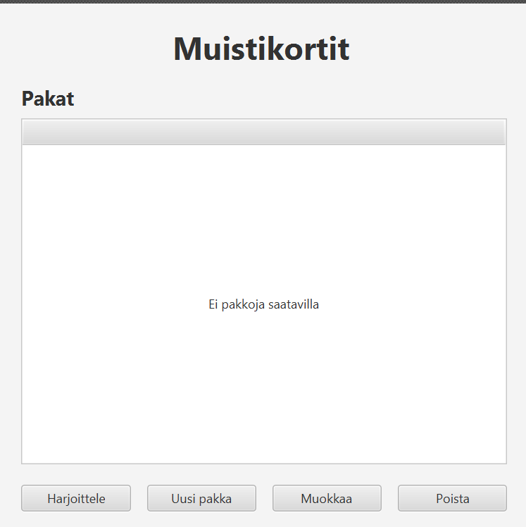
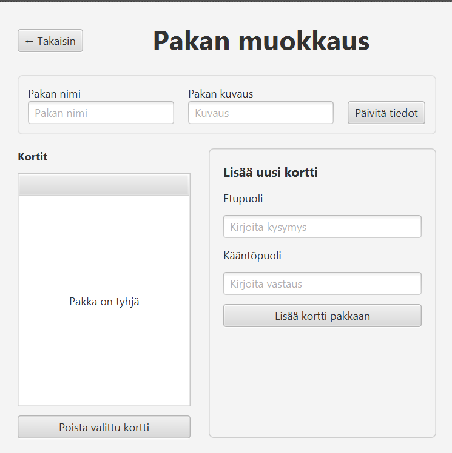
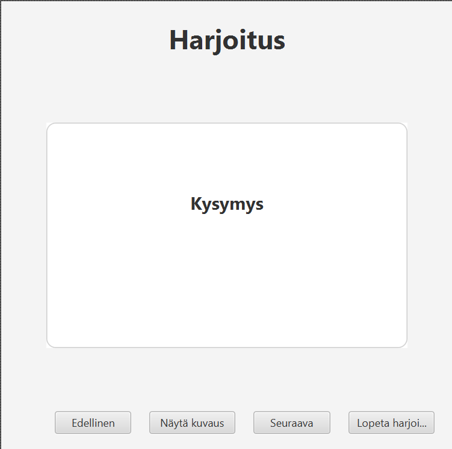

# Muistikortit

Päänäkymässä näkyy lista olemassa olevista pakoista sarakkeissa *Pakan nimi* ja *Kuvaus*. Alla on neljä painiketta:

- **Uusi pakka** — avaa dialogin, johon kirjoitetaan uuden pakan nimi ja kuvaus. Nimi tarkistetaan: se ei saa olla tyhjä, saa olla enintään 20 merkkiä eikä se saa olla jo käytössä (vertailu ei ole kirjainkoko­riippuvainen).
- **Harjoittele** — aloittaa valitun pakan harjoittelun. Jos pakkaa ei ole valittu tai se on tyhjä, sovellus näyttää virheilmoituksen.
- **Muokkaa** — avaa valitun pakan muokkausnäkymän. Saman toiminnon saa myös tuplaklikkaamalla pakan riviä.
- **Poista** — poistaa valitun pakan vahvistuksen jälkeen.

### Pakan muokkaus -näkymä

Tässä näkymässä voi:

1. **Muokata pakan nimeä ja kuvausta** — muutokset tallennetaan *Tallenna pakan tiedot* -painikkeella. Sama nimi­tarkistus on käytössä kuin uutta pakkaa luotaessa, mutta nyt nykyinen pakka sallitaan (saa säilyttää oman nimensä).
2. **Lisätä uuden kortin** — kirjoita kysymys ja vastaus, paina *Tallenna kortti*. Molemmat kentät ovat pakollisia. Lisäyksen jälkeen kentät tyhjenevät ja fokus palaa kysymyskenttään, jotta useita kortteja voi lisätä nopeasti peräkkäin.
3. **Poistaa valitun kortin** — valitse kortti taulukosta ja paina *Poista kortti*. Sovellus pyytää vahvistuksen ennen poistoa.
4. **Palata päänäkymään** — *Takaisin*-painikkeella. Muutokset tallentuvat aina levyä kohti.

### Harjoittelunäkymä

Harjoittelussa pakan kortit sekoitetaan (`Collections.shuffle`) ja näytetään yksi kerrallaan:

- **Kysymys** on näkyvissä suoraan.
- **Näytä vastaus** -painike paljastaa vastauksen; painiketta painamalla uudelleen sen voi piilottaa (*Piilota vastaus*).
- **Edellinen / Seuraava** -painikkeilla voi selata kortteja. Painikkeet ovat pois päältä ensimmäisen/viimeisen kortin kohdalla.
- **Lopeta** palaa päänäkymään kesken harjoittelun.
- Kun viimeinen kortti on selattu, sovellus ilmoittaa harjoituksen päättymisestä ja palaa päänäkymään automaattisesti.
